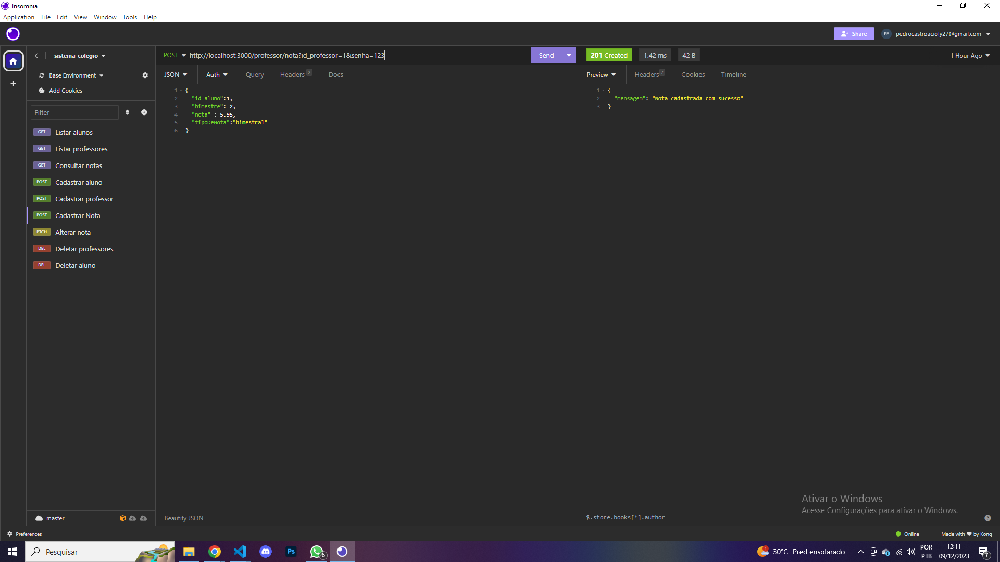
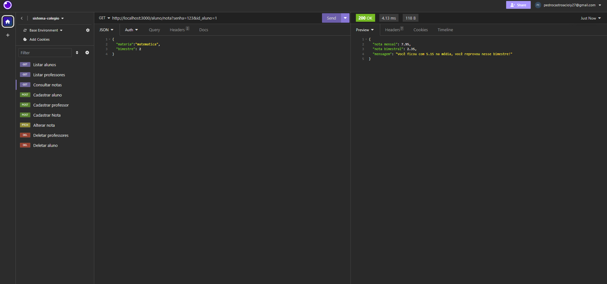

##### 

# API | Sistema de colégio (Node.Js)

  

# Sobre o projeto

### Projeto para portifólio, construído em Node.js e utilizando formatação JSON, esta API oferece operações CRUD eficientes para diretores, professores e alunos, permitindo fácil cadastro, atualização, listagem e remoção de dados, além de permitir busca precisa utilizando identificadores, facilitando a recuperação de informações específicas. Simplifica a administração acadêmica com integração descomplicada.

# Funcionalidades

## Diretor
- ### Cadastrar professores
- ### Cadastrar alunos
- ### Listar todos os alunos
- ### Listar todos os professores
- ### Deletar alunos
- ### Deletar professores
## Professor
- ### Cadastrar notas para um aluno
- ### Alterar nota já cadastrada
## Aluno
- ### Consultar notas

# Tecnologias usadas
- ### JavaScript
- ### Node.js
- ### Express.js
- ### JSON

# Cadastro de Aluno
##### 

# Listar Alunos
### Aqui o diretor pode ver todos os alunos e suas respectivas notas cadastradas
##### 

# Cadastro de Nota
### Aqui o professor pode cadastrar nota, apenas duas notas podem ser cadastradas por bimestre, uma mensal e uma bimestral, caso tente cadastrar mais de uma "mensal" no mesmo bimestre, vai dar erro, caso coloque algo errado, também tem a funcionalidade de alterar nota
##### 

# Consultar nota
### Aqui o aluno poderá consultar suas nota por bimestre, caso ainda nao tenha nenhuma, aparecerá um erro, caso tenha apenas uma nota, o programa vai listar a sua nota e o quanto ele precisará para ficar na média(já pré determinada), e caso já tenha as duas notas cadastradas, o programa dirá as suas notas, média e se passou ou não nesse bimestre
##### 


# Para executar este projeto localmente, você precisa:

- ### Instale dependências para back-end
```shell
npm install
```
- ### Execute cada projeto com
```shell
npm run dev
```
# Licença
